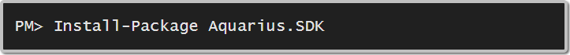

# AQUARIUS SDK for .NET 

The **AQUARIUS SDK for .NET** enables .NET developers to easily work with the [AQUARIUS Platform](http://aquaticinformatics.com/products/) of environmental monitoring products.

* [AQUARIUS Time-Series](http://aquaticinformatics.com/products/aquarius-time-series/)
* [AQUARIUS Samples](http://aquaticinformatics.com/products/aquarius-samples/) (coming soon!)
* [AQUARIUS WebPortal](http://aquaticinformatics.com/products/aquarius-webportal/) (coming soon!)

View the [Release Notes](ReleaseNotes.md) here.

## Downloading

## Getting Help

See the [Wiki](https://github.com/AquaticInformatics/aquarius-sdk-net/wiki) for basic SDK concepts and examples.

## Contributing

Contributions are always welcome, no matter how large or small. Before contributing, please read the [code of conduct](CODE_OF_CONDUCT.md).

See [Contributing](CONTRIBUTING.md).

